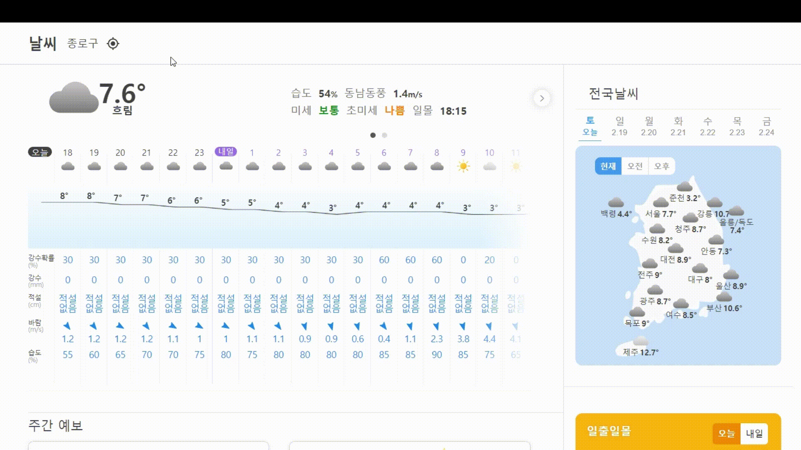
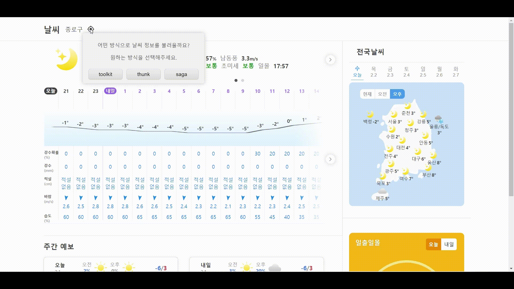
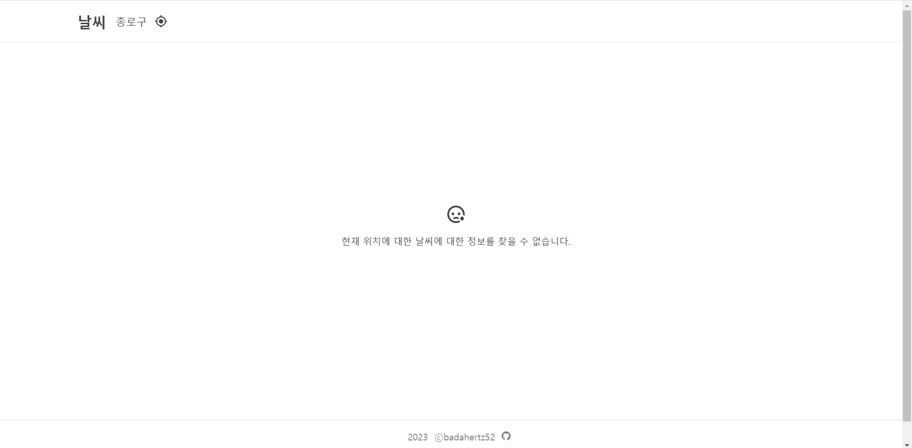
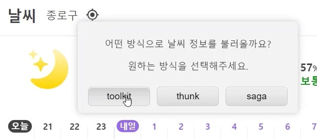

# Weather

[⛅ weather 사이트 바로가기](https://port-0-weather-react-3a9t2ble8fxyoi.sel3.cloudtype.app/weather_react/)

---

## Index

#### <a href="#introduce">1. Introduce</a>

#### <a href="#skill">2.Tech skill & Built with</a>

#### <a href="#start">3. Getting Start</a>

#### <a href="#view">4. Layout and View </a>

#### <a href="#description">5. Description</a>

#### <a href="#other">6.Other</a>

---

## <div id="introduce">1. Introduce</div>

## 1) weather 소개

weather 는 kakao local REST API와 공공 데이터 포털에서 제공받은 데이터를 통해 사용자에게 사용자의 현재 위치에 따른 국내의 날씨 정보를 알려주는 날씨 정보 사이트입니다.
사용자는 현재의 자신의 위치에 따른 현 시점의 날씨, 앞으로 3일 이내의 시간별 날씨, 일주일간의 전국 날씨, 일출 일몰 시각을 제공받을 수 있습니다.
웹프론트, 웹디자인으로 [네이버 날씨](https://weather.naver.com)를 참고해 만들었습니다.

### ✨프로젝트 목적

- CORS 정책을 준수하며 외부에서 제공하는 데이터를 REST FUL하게 받아오기
- redux-toolkit , redux-middleware인 thunk 와 saga 의 차이점을 경험해보고 각각의 장단점과 언제 사용해야하는지 생각해보기
- Github의 action 와 Secret를 사용해 API key 를 깃헙에 올리지 않고도 사용할 수 있게 하기
- table,th,td,tr의 태그 사용에 익숙해지기
- 시간별 날씨를 그래프로 표현해보기
- Node.js를 사용해 서버를 만들고 React와 연동하기
- Node 서버에서 외부 API에서 데이터를 Node 서버에서 받아서 프론트에 넘기기

---

## <div id="skill">2.Tech skill & API</div>

## Tech skill

- js , typescript
- scss
- react
- styled-components
- react-icon
- redux ,redux-toolkit
- redux-saga
- redux-thunk
- chart.js
- node.js , express

## API

- [공공 데이터 포털](https://www.data.go.kr/index.do)
- [kakao local REST API](https://developers.kakao.com/docs/latest/ko/local/dev-guide)

---

## <div id="start">3. Getting Start</div>

```
npm i
```

- 개발 환경에서 실행 방법
  ```
  npm run dev // 서버 실행
  ```
  http://localhost:5000/weather_react/ 이동

---

## <div id="view">4. Layout and Operate </div>

### 1) Layout and Responsive Web


### 2) View

### a. Main



### b. Loading :

Screen when fetching data



### c. Failure :

Screen when fetching data failed



---

## <div id="description">5.Description </div>

#### 1) Structure

#### A. Server

```
server.js
```

#### B. Client

#### a. Modules

```
  src/modules
    -position
      -index
      -reducer
      -saga
      -thunk
      -toolkit
      -types
    -weather
      -index
      -reducer
      -saga
      -thunk
      -toolkit
      -types
```

#### b. Components

| name      | description                                                              |
| --------- | ------------------------------------------------------------------------ |
| Hourly    | 오늘로부터 3일간의 시간별 날씨 정보를 보여줌                             |
| Location  | 사용자의 위치정보를 찾고, 이를 보여줌                                    |
| Loading   | 위치 정보와 날씨 정보를 불어올 때 화면에 나타나 현재 진행상황을 표시     |
| Nation    | 오늘로부터 일주일간의 전국 날씨를 보여줌                                 |
| None      | 날씨 정보가 없을 때 정보가 없음을 알려줌                                 |
| Now       | 현재 사용자가 있는 장소의 실시간 날씨 정보를 알려줌                      |
| ScrollBtn | 터치나 마우스로 스크롤이 가능한 요소를 왼쪽이나 오른쪽으로 넘겨주는 버튼 |
| SkyIcon   | 하늘 상태를 아이콘을 표시                                                |
| Sun       | 한국의 일출,일몰 시각을 표시                                             |
| Week      | 사용자의 현재 위치에서 일주일 간의 날씨 정보를 알려줌                    |

### 2) State

```
  rootState
    -position
    -weather
```

- position state type

  ```typescript
  type PositionState = {
    state: DataState;
    error: Error | null;
    longitude: string | null;
    latitude: string | null;
    sfGrid: SFGridItem | null;
  };
  ```

- weather state type

  ```typescript
  type WeatherState = {
    state: DataState;
    error: Error | null;
    nowWeather: NowWeather | null;
    tomorrowWeather: TomorrowWeather | null;
    threeDay: DailyWeather[] | null;
    week: Day[] | null;
    nation: NationType | null;
    sunRiseAndSet: (SunRiseAndSet | Error)[] | null;
  };
  ```

### 3) Dispatch and Function



- redux-toolkit, redux-thunk ,redux-saga를 사용한 함수

|         | position                      | weather                     |
| ------- | ----------------------------- | --------------------------- |
| toolkit | toolkitPosition               | toolkitWeather              |
| thunk   | getPositionThunk              | getWeatherThunk             |
| saga    | getPositionSaga, positionSaga | getWeatherSaga, weatherSaga |

<br/>

사용자가 선택한 버튼에 따라 redux-toolkit, redux-thunk, redux-saga 를 사용해 정의한 각각의 함수에서 action을 dispatch 한다.

---

## <div id="other">6. Other</div>

### 1) 프로젝트 진행하면서 배운 것들

- 👩‍💻[React(CRA) 개발 시 API Key 설정,보안 (width Github Actions ,Secrets)](https://velog.io/@badahertz52/ReactCRA-개발-시-API-Key-설정보안)

- 👩‍💻[redux-thunk 와 redux-saga](https://velog.io/@badahertz52/redux-thunk-와-redux-saga)
- 👩‍💻[React 와 Node(express) 연동](https://velog.io/@badahertz52/React-Nodeexpress-%EC%97%B0%EB%8F%99)
- 👩‍💻[React와 Node 연동 시 404error ](https://velog.io/@badahertz52/error-note-React-%EC%99%80-Node.js-%EC%97%B0%EB%8F%99%EC%8B%9C-404-error)
- 👩‍💻[Node.js 를 통한 mixed-content 오류 해결](https://docs.cloudtype.io/guide/references/env)

- 👩‍💻[weather 프로젝트 후기](https://velog.io/@badahertz52/Weather-%ED%94%84%EB%A1%9C%EC%A0%9D%ED%8A%B8-%ED%9B%84%EA%B8%B0)

### 2) 자료

- <a target="_blank" href="https://icons8.com/icon/QLN0wP83VFpj/sunny">파비콘 출처</a>
  icon by <a target="_blank" href="https://icons8.com">Icons8</a>
