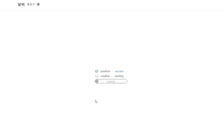

# Weather 

[⛅ weather 사이트 바로가기](https://badahertz52.github.io/weather_react/)

-------------------------
## Index
####  <a href="#introduce">1. Introduce</a>
####  <a href="#skill">2.Tech skill & Built with</a>
####  <a href="#start">3. Getting Start</a>
####  <a href="#view">4. Layout and View </a>
####  <a href="#description">5. Description</a>
####  <a href="#other">6.Other</a>

----------------------------

##  <div id="introduce">1. Introduce</div>
## 1) weather 소개 
  weather 는 kakao REST API와 공공 데이터 포털에서 제공받은 데이터를 통해 사용자에게 사용자의 현재 위치에 따른 국내의 날씨 정보를 알려주는 날씨 정보 사이트입니다. 
  사용자는 현재의 자신의 위치에 따른 현 시점의 날씨, 앞으로 3일 이내의 시간별 날씨, 일주일간의 전국 날씨, 일출 일몰 시각을 제공받을 수 있습니다. 
  웹프론트, 웹디자인으로 [네이버 날씨](https://weather.naver.com)를 참고해 만들었습니다.

###  프로젝트 목적
* CORS 정책을 준수하며 외부에서 제공하는 데이터를 REST FUL하게 받아오기
* redux-toolkit , redux-middleware인 thunk 와 saga 의 차이점을 경험해보고 각각의 장단점과 언제 사용해야하는지 생각해보기 
* Github의 action 와 Secret를 사용해 API key 를 깃헙에 올리지 않고도 사용할 수 있게 하기 
* table,th,td,tr의 태그  사용에 익숙해지기
* 시간별 날씨를 그래프로 표현해보기 

-----------------
##  <div id="skill">2.Tech skill & API</div>

## Tech skill

* js , typescript
* scss
* react
* styled-component
* react-icon
* redux ,redux-toolkit
* redux-saga
* redux-thunk
* chart.js

## API
* [공공 데이터 포털](https://www.data.go.kr/index.do)
* [kakao REST API](https://developers.kakao.com/docs/latest/ko/local/dev-guide)
  
--------------
##  <div id="start">3. Getting Start</div>
```
npm install react react-dom react-redux  redux redux-thunk
npm install @types/react-redux redux-saga 
npm install --save react-icon styled-component 
npm install chart.js
```
--------------
##  <div id="view">4. Layout and Operate </div>

### 1) Layout and Responsive Web


### 2) View 

### a. Main



### b. Loading : 
Screen when fetching data


### c. Failure : 
Screen when fetching data failed


-------------
##  <div id="description">5.Description </div>

### 1) State
```
  rootState
    -positoin
    -weather
```
* position  state type
  ``` typescript

  type PositionState = {
    state: DataState;
    error: Error | null;
    longitude: string | null;
    latitude: string | null;
    sfGrid: SFGridItem | null;
  }
  ```
* weather state stype
  
  ```typescript
    type WeatherState = {
      state: DataState;
      error: Error | null;
      nowWeather: NowWeather | null;
      tomorrowWeather: TomorrowWeather | null;
      threeDay: DailyWeather[] | null;
      week: Day[] | null;
      nation: NationType | null;
      sunRiseAndSet: (SunRiseAndSet | Error)[] | null;
    } 
  ```
### 2) Dispatch and Function


* redux-toolkit, redux-thunk ,redux-saga를 사용한 함수 
  
||position|weather|
|---|---|--------|
|tooklit|toolkitPosition|toolkitWeather|
|thunk|getPositionThunk|getWeatherThunk|
|saga|getPositionSaga, positionSaga|getWeatherSaga, weatherSaga|

<br/>

사용자가 선택한 버튼에 따라 redux-tooklit, redux-thunk, redux-saga 를 사용해 정의한 각각의 함수에서 action을 dispatch 한다. 

-----------------
##  <div id="other">6. Other</div>

### 1) 프로젝트 진행하면서 배운 것들 

* 👩‍💻[API Key 설정, 보안](https://velog.io/@badahertz52/ReactCRA-개발-시-API-Key-설정보안)

* 👩‍💻[redux-thunk 와 redux-saga](https://velog.io/@badahertz52/redux-thunk-와-redux-saga)

### 2) 자료 
* <a target="_blank" href="https://icons8.com/icon/QLN0wP83VFpj/sunny">파비콘 출처</a> 
icon by <a target="_blank" href="https://icons8.com">Icons8</a>

